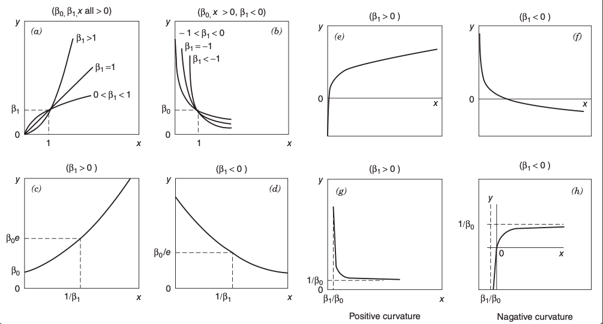

```{r}
library(MASS)
library(latex2exp)
library(ggplot2)
library(tibble)
library(dplyr)
library(ggpubr)
library(QuantPsyc)
```


En el modelo habitual de regresión partimos del supuesto que hay una relación lineal entre la variable $y$ y los regresores. Sin embargo en algunos casos esta suposición es inadecuada, puesto que por ejemplo si observamos los gráficos de dispersión esta suposición puede no estarse cumpliendo de manera evidente. Para poder solucionar este problema de no linealidad, en algunos casos a estos modelos podemos hacerlos lineales, usando una transformación adecuada.

Quizás nos preguntemos que comportamiento deberíamos observar para poder
encontrar una transformación que pueda linealizar el modelo. Antes de
mostrar algunos casos comunes en los que podemos transformar, veamos un
ejemplo de que va transformar un modelo que a primera vista no es
lineal, pero si podemos hacerlo lineal.

Consideremos la función $$y=\beta_0 e^{\beta_1 x}\varepsilon$$ Esta
función como podemos ver no es linear, pero la podemos transformar en
una lineal si aplicamos un logaritmo, con lo que obtenemos
$$\ln{y}=\ln{\beta_0 e^{\beta_1 x}\varepsilon}=\ln{\beta_0}+\beta_1 x+\ln{\varepsilon}$$
Haciendo $y'=\ln{y}$, $\ln{\beta_0}=\beta_0'$, $\ln{\beta_1}=\beta_1'$ y
$\ln{\varepsilon}=\varepsilon'$, tenemos el modelo
$$y'=\beta_0'+\beta_1' x+\varepsilon'.$$ Como podemos observar en esta
transformación estamos tomando el logaritmo del error, de modo que si
queremos que haya normalidad en los errores de la transformación es
decir $\ln{\varepsilon}$ sea normal distribuido con media $0$ y varianza
$\sigma^2$, lo que implica que el error multiplicativo en el modelo
original $\varepsilon$, debe tener distribución log normal.

***Comentario:*** De igual forma que en el modelo de regresión simple,
cuando linealizamos un modelo es necesario realizar la validación de supuestos.



Otro ejemplo de modelos que podemos linealizar, son el caso de
transformaciones reciprocas, es decir algo de la forma

$$\dfrac{1}{y}=\beta_0+\beta_1 x+\varepsilon$$ y
$$y=\dfrac{x}{\beta_0 x-\beta_1}+\epsilon$$ ***Comentario:*** Cuando las
transformaciones como las anteriores son empleadas el estimador de
mínimos cuadrados tiene propiedades de mínimos cuadrados con respecto a los datos transformados, ***no a los originales***.

**Ejemplo (Molino de Viento)**

```{r}
tabla1 <- data.frame(stringsAsFactors=FALSE,
Velocidad_Viento = c(5.00, 6.00, 3.40, 2.70,
      10.00, 9.70, 9.55, 3.05, 8.15, 6.20, 2.90, 6.35, 4.60, 5.80, 7.40, 3.60,
      7.85, 8.80, 7.00, 5.45, 9.10, 10.20, 4.10, 3.95, 2.45),
Salida_DC = c(1.582, 1.822, 1.057, 0.500, 2.236, 2.386, 2.294, 0.558, 2.166, 1.866,
     0.653, 1.930, 1.562, 1.737, 2.088, 1.137, 2.179, 2.112, 1.800, 1.501, 2.303,
     2.310, 1.194, 1.144, 0.123)
)
names(tabla1)<-c("Velocidad del Viento (Mph)","Salida DC")
tabla1
```

Un ingeniero, está investigando el uso de un molino de viento para
generar electricidad. Ha recopilado datos sobre la salida de DC de su
molino de viento y la velocidad del viento correspondiente. La
inspección del diagrama de dispersión indica que la relación entre la
salida de DC $(y)$ y la velocidad del viento $(x)$ puede ser no lineal
como veremos a continuación del gráfico de dispersión.

```{r}
plot(tabla1$`Velocidad del Viento (Mph)`,tabla1$`Salida DC`,xlab=TeX(r'(Velocidad del Viento $x$ )'),ylab=TeX(r'(Salida DC $y$)'),pch=20,cex=2)
mult.norm(tabla1)$test
```

Como se puede observar del gráfico de dispersión, pareciera que la
relación entre la salida del voltaje en función de la velocidad del
viento es no lineal. Lo cual podemos contrastar con el trafico de
residuales.

Para ellos,a justando un modelo lineal obtenemos

```{r}
modelo1<-lm(tabla1$`Salida DC`~tabla1$`Velocidad del Viento (Mph)`)
summary(modelo1)
shapiro.test(modelo1$residuals)
```

```{r}
plot(modelo1$fitted.values,modelo1$residuals,pch=19,xlab="Ajustado",ylab="Residuales",panel.smooth(modelo1$fitted.values,modelo1$residuals))
plot(modelo1,which=1,sub.caption="")
qqnorm(y=modelo1$residuals)
qqline(modelo1$residuals)
```

Este comportamiento observado, hace pensar que en efecto el modelo lineal no es el adecuado y quizás un modelo cuadrático del tipo $$y=\beta_0+\beta_1 x+\beta_2 x^2+\varepsilon$$
resulte mejor para explicar la curvatura aparente. Sin embargo podemos observar del diagrama de dispersión que a medida que la velocidad del viento aumenta, la salida de voltaje se acerca un punto extremo de 2.5 , lo cual es consistente con el funcionamiento de un molino de viento. Dado que el modelo cuadrático eventualmente se doblará, esto indicaría que a velocidades mas altas de este punto máximo observado la salida de voltaje disminuiría lo cual, con lo cual nuevamente el modelo cuadrático tampoco seria adecuado para los datos.

Como mencionamos a medida que la velocidad aumenta, la salida de voltaje pareciera alcanzar un punto extremo, de manera que tiende como a estabilizarse, lo que sugiere que una transformación de tipo reciproca sea lo mas adecuada, pues en ellas incorporamos asíntotas, y en este caso buscamos que haya una asíntota superior que se acerque a este valor extremo. Transformando el modelo como
$$y=\beta_0+\beta_1 \left(\dfrac{1}{x}\right)+\varepsilon.$$
Usando esta transformación veamos su relación mediante el gráfico de dispersión

```{r}
plot(1/tabla1$`Velocidad del Viento (Mph)`,tabla1$`Salida DC`,xlab=TeX(r'(Velocidad del Viento $x$ )'),ylab=TeX(r'(Salida DC $y$)'),pch=20,cex=2)

ynuevos<-(tabla1$`Salida DC`)^2
#plot(tabla1$`Velocidad del Viento (Mph)`,ynuevos)
#modelo22<-lm(ynuevos~tabla1$`Velocidad del Viento (Mph)`)
#plot(modelo22)

xnuevos<-log(tabla1$`Velocidad del Viento (Mph)`)
modelo222<-lm(tabla1$`Salida DC`~xnuevos)
plot(modelo222,,sub.caption="",which=c(1,2),pch=19)
```
Ajustando el modelo, tenemos como resultado
```{r}
tabla2 <- data.frame(stringsAsFactors=FALSE,
Velocidad_Viento = 1/c(5.00, 6.00, 3.40, 2.70,
      10.00, 9.70, 9.55, 3.05, 8.15, 6.20, 2.90, 6.35, 4.60, 5.80, 7.40, 3.60,
      7.85, 8.80, 7.00, 5.45, 9.10, 10.20, 4.10, 3.95, 2.45),
Salida_DC = c(1.582, 1.822, 1.057, 0.500, 2.236, 2.386, 2.294, 0.558, 2.166, 1.866,
     0.653, 1.930, 1.562, 1.737, 2.088, 1.137, 2.179, 2.112, 1.800, 1.501, 2.303,
     2.310, 1.194, 1.144, 0.123)
)
names(tabla2)<-c("Velocidad del Viento (Mph)","Salida DC")
tabla2
```


```{r}
modelo2<-lm(tabla2$`Salida DC`~tabla2$`Velocidad del Viento (Mph)`)
summary(modelo2)
```
```{r}
plot(modelo2$fitted.values,rstudent(modelo2),pch=19,xlab="Ajustado",ylab="Residuales")
abline(h=0,lty=2,col="red")
plot(modelo2)
ggqqplot(modelo2$residuals)
#mult.norm(tabla1)$mult.test
```
##### **Ejemplo Datos MariaJuana**

Veamos ahora si podemos aplicar alguna transformación al conjunto de datos de Mariajuana. Recordemos que en este conjunto de datos teníamos en esencia tres subconjuntos a causa de los tres cantidades que se tenían para la dosis. De esta manera es conveniente trabajar con estos tres subconjuntos. 
Recordemos que las transformaciones que vimos previamente por ahora están limitadas a la regresión lineal simple, con lo cual consideraremos la altura como función de precipitación o como función de la temperatura.


```{r}
## Carga del conjunto de datos
maria<-read.table("/Users/danimathud/Documents/GitHub/R_projects/ModelosEstadisticos1/Datas/Mariajuana.txt")
maria

```

```{r}
## Filtrado
maria_dosis0<-maria %>% filter(Dosis.en.kg==0)
maria_dosis0

maria_dosis1<-maria %>% filter(Dosis.en.kg==1)
maria_dosis1

maria_dosis15<-maria %>% filter(Dosis.en.kg==1.5)
maria_dosis15
```


```{r}
par(mfrow=c(1,3))
plot(maria_dosis0[,1:3],lower.panel=NULL,main="Dosis 0",pch=19,col="red")
par(mfrow=c(1,3))
plot(maria_dosis1[,1:3],lower.panel=NULL,main="Dosis 1",pch=19,col="blue")
par(mfrow=c(1,3))
plot(maria_dosis15[,1:3],lower.panel=NULL,main="Dosis 1.5",pch=19,
     col="magenta")
#plot(maria[,1:3],lower.panel=NULL)
#plot3d(maria[,1:3])
```

Para este ejemplo consideremos el subconjunto para dosis de 1.5, y veamos para cual resulta mas conveniente una transformación, si para altura en función de temperatura o altura en función de precipitación.


**Altura en función de la temperatura**
```{r}
modelo3<-lm(maria_dosis15$Altura.en.cm~maria_dosis15$Temperatura.en.C)
plot(modelo3,pch=19)
shapiro.test(modelo3$residuals)
plot(maria_dosis15$Temperatura.en.C,maria_dosis15$Altura.en.cm,xlab="Temperatura",ylab="Altura",pch=19)
abline(modelo3,col="red")
```
 
Como podemos considerando altura en función de temperatura, aunque del gráfico de residuales y QQ pareciera que se cumplen todos los supuestos de regresión lineal y normalidad en los errores, sin embargo podemos ver también, que la recta no se ajusta lo suficientemente bien. Por lo cual podríamos intentar transformar los datos esperando conseguir un mejor resultado en el ajuste del modelo.

Notemos de los datos que la recta que ajustemos tiene parámetro $\beta_1<0$ y la temperatura que consideramos es positiva, con lo cual podemos observar que nuestros datos, tienen mas parecido con los gráficos b) y d) de la figura mostrada en un inició, así podríamos intentar considerar como transformaciones 

$$\log{y}=\log{\beta_0 x^{\beta_1}}=\log{\beta_0}+\beta_1\log{x}$$
o 
 $$\log{y}=\log{\beta_0 e^{\beta_1 x}}=\log{\beta_0}+\beta_1 x.$$
Veamos  cual de estas nos da buenos resultados 

```{r}
y1_tran<-log(maria_dosis15$Altura.en.cm)
x1_tran<-log(maria_dosis15$Temperatura.en.C)
plot(x1_tran,y1_tran,pch=19,main=TeX(r'("Transformando con $y'=\log{(y)}$ y $x'=\log{(x)}$)'),xlab="log(Temperatura)",ylab="log(Altura)")
modelo3_tran1<-lm(y1_tran~x1_tran)
abline(modelo3_tran1,col="blue")
plot(modelo3_tran1,pch=19)
shapiro.test(modelo3_tran1$residuals)
```
```{r}
plot(maria_dosis15$Temperatura.en.C,y1_tran,pch=19,main=TeX(r'("Transformando con $y'=\log{(y)}$)'),ylab="log(Altura)",xlab="Temperatura")
modelo3_tran2<-lm(y1_tran~maria_dosis15$Temperatura.en.C)
abline(modelo3_tran2,col="red")
plot(modelo3_tran2,pch=19)
shapiro.test(modelo3_tran2$residuals)
```
 

